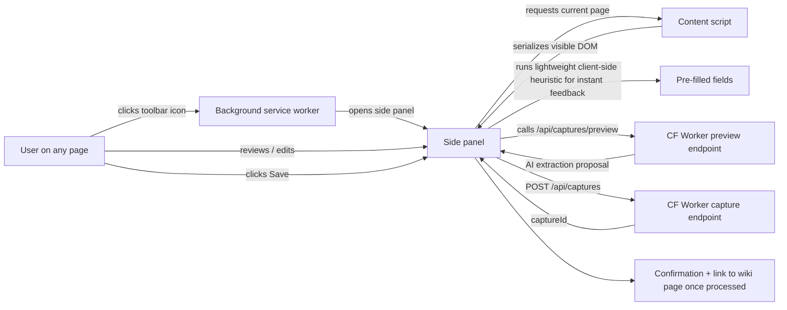

# Extension build plan (V2)

Manifest v3 Chrome / Edge / Firefox extension. Build target: V2.

## Architecture

```
manifest.json                          # MV3 manifest
src/
  background.ts                        # service worker; auth state, side-panel orchestration
  contentScript.ts                     # injected per-tab; serializes visible DOM
  sidepanel/
    index.html
    main.tsx                           # React + shadcn (lightweight bundle)
  apiClient.ts                         # POST /api/captures + auth refresh
  hostHeuristics/                      # client-side hints; main extraction is server-side
    chatgpt.ts
    claude.ts
    gemini.ts
    perplexity.ts
    axial.ts
    bizbuysell.ts
    generic.ts
  auth.ts                              # better-auth client; OAuth flow
public/
  icons/16.png 32.png 48.png 128.png
```

## User flow



## Permissions (MV3)

- `activeTab` — read the active tab's DOM only when the user invokes the extension.
- `sidePanel` — open the side panel.
- `storage` — store auth tokens.
- `host_permissions: []` — empty by default; we ride on `activeTab`.

We deliberately do **not** request `<all_urls>` host permissions because we never run in the background on any page. This keeps install friction low and clearly signals the doctrine.

## Auth

- Better-auth client in the extension.
- OAuth flow opens a popup to the Clearbolt web app for sign-in.
- Token stored in `chrome.storage.session` (cleared on browser quit; user can opt for `chrome.storage.local` to persist).
- Token attached to every `POST /api/captures` call.

## Server contract

`POST /api/captures` (CF Worker):

```ts
type CaptureRequest = {
  sourceUrl: string;
  host: string;
  rawHtml: string;
  hostHeuristicVersion: string;
  suggestedFields: Record<string, unknown>;
  userConfirmedFields: Record<string, unknown>;
  userNotes?: string;
  attachToCanonicalDealId?: string;
};

type CaptureResponse = { captureId: string };
```

`GET /api/captures/:id` polls for processing status (the side panel can show "processing" and "done" states).

## Heuristics on both sides

- **Client-side heuristics** (`src/hostHeuristics/*`) give the user immediate pre-filled fields without a server round-trip.
- **Server-side heuristic registry** ([`packages/capture/agents.md`](../../packages/capture/agents.md)) does the canonical extraction once the raw HTML lands. Server-side heuristics can be richer (full AI extraction, broker lookup) and are versioned for replay.

## V2 ship list

- MV3 build (Chrome + Edge first; Firefox via webextension-polyfill).
- Auth flow.
- Side panel UX.
- 7 client-side heuristics (Axial, ChatGPT, Claude, Gemini, Perplexity, BizBuySell, generic).
- POST to backend; status polling; "Open in Clearbolt" link.
- Per-host disclosure banner ("Captures from Axial follow Axial's terms; only capture deals you're authorized to use.").

## Out of scope (V3+)

- Bulk save (none of this; doctrine).
- Background scraping (none of this; doctrine).
- Cross-extension sync (none of this; per-user, per-workspace).

## Validation criteria

The extension's high-level doctrine guardrails live in [`agents.md`](agents.md). The plan-level validation is about the V2 ship list being implemented to spec.

### V2 ship-list completeness
- **Given** the V2 release, **when** the extension is loaded into Chrome, Edge, and Firefox, **then** it activates without errors and the side panel opens. Coverage: integration (E2E across browsers). Test: `apps/extension/tests/cross-browser-smoke.test.ts` (TBD V2).
- **Given** the V2 release, **when** the side panel is opened on each of the seven supported hosts (Axial, ChatGPT, Claude, Gemini, Perplexity, BizBuySell, generic), **then** the corresponding client-side heuristic produces pre-filled fields within 500ms of DOM serialization. Coverage: integration (E2E). Test: `apps/extension/tests/client-heuristic-prefill.test.ts` (TBD V2).
- **Given** the V2 release, **when** a capture is saved, **then** the side panel polls `GET /api/captures/:id` and shows "processing" → "done" with a working "Open in Clearbolt" link. Coverage: integration (E2E). Test: `apps/extension/tests/save-and-poll.test.ts` (TBD V2).

### Permissions hygiene
- **Given** the built extension, **when** scanned, **then** `manifest.json` declares only `activeTab`, `sidePanel`, `storage`, and an empty `host_permissions: []`. Coverage: lint over `manifest.json`. Test: `apps/extension/tests/manifest-permissions.test.ts` (TBD V2). Falsifiability for the doctrine: any expansion of permissions requires an ADR amendment.

### Per-host disclosure
- **Given** the user opens the side panel on a supported host with a disclosure banner, **when** the panel renders, **then** the banner is visible and includes the host name and ToS reminder. Coverage: integration (E2E). Test: `apps/extension/tests/disclosure-banner.test.ts` (TBD V2).

### Auth flow
- **Given** an unsigned-in user, **when** they click the toolbar icon, **then** the side panel triggers the better-auth OAuth popup; `chrome.storage.session` (or `local` if opted in) holds the token. Coverage: integration (E2E). Test: `apps/extension/tests/auth-popup.test.ts` (TBD V2).
- **Given** an expired token, **when** a capture is attempted, **then** the side panel transparently refreshes (without losing the user's edits) before retrying. Coverage: integration. Test: `apps/extension/tests/token-refresh.test.ts` (TBD V2).

### Out-of-scope guardrails (hard rule — these are doctrine, see [`agents.md`](agents.md))
- **Given** the V2 build, **when** code-reviewed, **then** there is no bulk-save UI, no background scrape loop, and no cross-extension sync code. Coverage: code-review checklist + lint for forbidden APIs (`chrome.alarms` for periodic crawl, etc.). Test: `apps/extension/tests/no-forbidden-apis.test.ts` (TBD V2).

### Cross-link
- Doctrine: [`agents.md`](agents.md).
- Backend contract: [`packages/capture/agents.md`](../../packages/capture/agents.md).
- ADR: [`docs/decisions/0004-extension-universal-user-capture.md`](../../docs/decisions/0004-extension-universal-user-capture.md).
