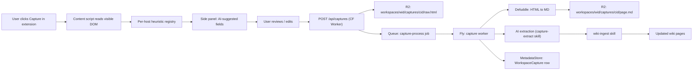

# Universal clipper pipeline

Captured in [`packages/capture/agents.md`](../../packages/capture/agents.md). Browser-side doctrine in [`apps/extension/agents.md`](../../apps/extension/agents.md). ADR: [../decisions/0004-extension-universal-user-capture.md](../decisions/0004-extension-universal-user-capture.md).

## What "universal" means

The clipper works on **any page**, including AI tool conversations (ChatGPT shares, Claude.ai, Gemini, Perplexity), private deal networks (Axial), public marketplaces (BizBuySell detail pages, broker websites), and arbitrary web pages.

Doctrine:

- **User-initiated only.** No background crawl, no pagination automation, no bulk capture, no cross-user pooling.
- **Per-user.** Captured pages land in the user's workspace; never aggregated into the shared listing cache without explicit cross-workspace consent.
- **Source URL preserved** for every capture.
- **Both raw HTML and converted Markdown stored** so we can re-extract on better parsers/prompts later without re-fetching.
- **AI extraction proposes structured fields**; user reviews and confirms before save.

## Pipeline



## Browser side (extension, V2)

Manifest v3 extension. Detail in [`apps/extension/PLAN.md`](../../apps/extension/PLAN.md).

- On click, the content script reads the active tab's visible DOM and serialises raw HTML.
- Per-host heuristic registry maps hostnames to extractors:
  - `axial.net` -> Axial opportunity-page extractor (per-user, manual, ToS-respecting).
  - `chat.openai.com`, `chatgpt.com/share/...` -> ChatGPT conversation extractor.
  - `claude.ai` -> Claude conversation extractor.
  - `gemini.google.com` -> Gemini conversation extractor.
  - `perplexity.ai` -> Perplexity answer extractor.
  - `bizbuysell.com/Business-Opportunity/...` -> BizBuySell detail extractor.
  - generic fallback -> `defuddle` markdown + visible-text proposal.
- Side panel: shows AI-suggested fields, lets user edit/confirm, then `POST /api/captures`.

## Server side (V1)

`POST /api/captures` lives on a **CF Worker** (latency-critical, globally distributed):

1. Validate auth (better-auth token, workspace ID claim).
2. Write raw HTML blob to R2 at `workspaces/<workspaceId>/captures/<captureId>/raw.html`.
3. Insert pending `WorkspaceCapture` row in `MetadataStore` (Neon HTTP driver).
4. Enqueue processing job (R2 key + workspace ID + user ID + capture ID + source URL + host).
5. Return `{ captureId }` to the extension.

Processing worker on **Fly.io** picks up the job:

1. Convert `rawHtml -> markdown` via Defuddle (default; pluggable per [contracts.md](contracts.md) `HtmlToMarkdown`).
2. Store the converted markdown alongside raw HTML (`workspaces/<workspaceId>/captures/<captureId>/page.md`).
3. Run AI extraction pass via `packages/agents` (calls a `capture-extract` skill) to produce structured fields and a summary.
4. Route to wiki maintainer agent: `wikiUpsertPage({ workspaceId, target: 'capture' | 'deal' | 'broker' | 'conversation', payload })`.
5. Mark `WorkspaceCapture` row complete in `MetadataStore` with extracted fields, status, summary, R2 keys, and optional `attachToCanonicalDealId` if the user pinned the capture to a known deal.

## Per-host heuristic registry

The heuristic registry is a contract (`HostHeuristic` per [contracts.md](contracts.md)) so new hosts add as plugin entries:

```ts
interface HostHeuristic {
  hostMatchers: (string | RegExp)[];
  extract(rawHtml: string, url: string): Promise<{
    suggestedFields: Record<string, unknown>;
    summary?: string;
    confidenceHints?: Record<string, 'low' | 'medium' | 'high'>;
  }>;
}
```

V1 heuristics: Axial, ChatGPT, Claude.ai, Gemini, Perplexity, BizBuySell detail, generic fallback. New ones land as separate plugin packages or contributions to the `packages/capture/heuristics/` directory.

## Phasing

- **V0**: not implemented. Pipeline contracts documented only.
- **V1**: backend `POST /api/captures` (CF Worker) + `packages/capture` processing pipeline (Fly) + `WorkspaceCapture` model + wiki maintainer skill `capture-ingest`. User-side capture is via API (curl, scripts) — the actual extension is not built yet.
- **V2**: build the actual Manifest v3 extension and ship it.

## Doctrine guardrails

ADR [../decisions/0004-extension-universal-user-capture.md](../decisions/0004-extension-universal-user-capture.md) codifies:

- No auto-crawling.
- No pagination automation.
- No bulk import.
- No background scraping.
- No cross-workspace pooling of captures.
- No model training on captured content from private networks.
- No bypass of authentication, paywalls, or technical controls.
- Each capture is an explicit user action on a page they are actively viewing.

## Validation criteria

### Functional
- **Given** an authenticated `POST /api/captures` request from the browser extension with raw HTML and source URL, **when** the CF Worker handler runs, **then** within 200ms it writes the raw HTML to R2, inserts a pending `WorkspaceCapture` row, enqueues the processing job, and returns `{ captureId }`. Coverage: integration. Test: `services/capture-api/tests/post-captures.test.ts` (TBD V1).
- **Given** a pending `WorkspaceCapture` job, **when** the Fly capture worker processes it, **then** within 30 seconds it has converted HTML→markdown via Defuddle, stored both blobs, run AI extraction, routed to wiki maintainer, and marked the row complete. Coverage: integration. Test: `services/capture-worker/tests/end-to-end.test.ts` (TBD V1).
- **Given** a host with a registered `HostHeuristic`, **when** the worker processes a capture from that host, **then** the heuristic's `extract()` is invoked and its `suggestedFields` populate the AI extraction prompt. Coverage: unit. Test: `packages/capture/tests/host-heuristic-invoked.test.ts` (TBD V1).
- **Given** a host without a registered heuristic, **when** the worker processes a capture, **then** the generic fallback is used and the capture still completes. Coverage: integration. Test: `packages/capture/tests/generic-fallback.test.ts` (TBD V1).

### Privacy
- **Given** a capture from a private deal network host (e.g., `axial.net`), **when** the capture is stored, **then** the row is marked `confidential: true`, `redistributionAllowed: false`, and the wiki maintainer cites it only inside the workspace. Coverage: unit. Test: `packages/capture/tests/private-network-flags.test.ts` (TBD V1).
- **Given** any capture, **when** stored, **then** it lives under the workspace prefix in R2 (`workspaces/<workspaceId>/captures/<captureId>/...`). Coverage: integration. Test: `packages/capture/tests/r2-key-scoped-to-workspace.test.ts` (TBD V1).

### Doctrine guardrails (per ADR 0004)
- **Given** the browser extension code, **when** reviewed, **then** there are zero pagination loops, zero background fetch timers, zero bulk-import endpoints. Coverage: code review + lint. Test: `apps/extension/tests/no-auto-crawl.lint.test.ts` (TBD V2).
- **Given** more than 20 captures from one user in <5 minutes, **when** the rate limiter sees them, **then** further captures are rate-limited with a clear message ("you appear to be bulk-importing; this is not supported"). Coverage: integration. Test: `services/capture-api/tests/rate-limit-bulk.test.ts` (TBD V2).

### Failure modes
- **Given** Defuddle conversion fails for a particular page, **when** the worker processes it, **then** the raw HTML is preserved, the `WorkspaceCapture` row is marked `status: 'processed_partial'`, and the wiki maintainer receives the raw HTML for best-effort extraction. Coverage: integration. Test: `services/capture-worker/tests/defuddle-failure-degraded.test.ts` (TBD V1).
- **Given** AI extraction returns nothing usable, **when** the worker completes, **then** the user sees an empty side-panel proposal and can manually fill the fields. Coverage: integration. Test: `services/capture-worker/tests/empty-extraction-graceful.test.ts` (TBD V1).
