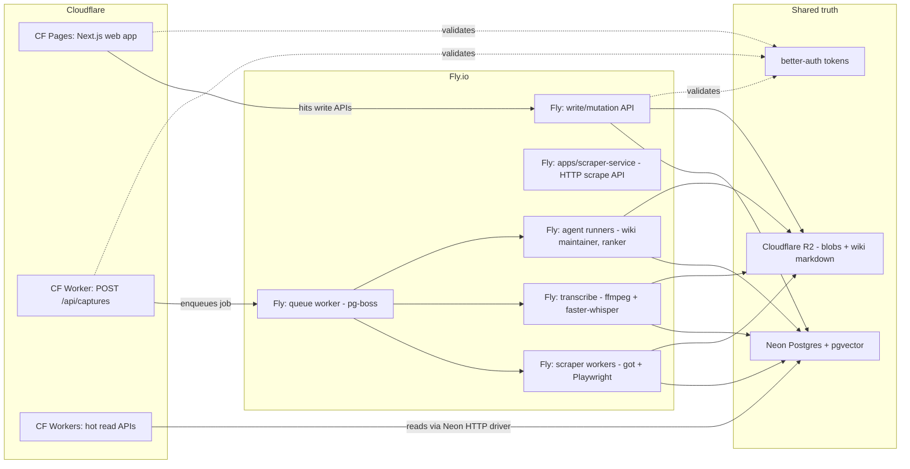

# Deployment topology

Production deployment is hybrid Cloudflare + Fly.io with Neon (Postgres + pgvector) and R2 as the shared truth. ADR: [0010-deployment-hybrid-cf-fly.md](../decisions/0010-deployment-hybrid-cf-fly.md).

V0 is local-dev only and runs nothing in the cloud. Production starts at V1.

## Topology

## What runs where, and why

### Cloudflare side

- **CF Pages** hosts the Next.js web app. Edge SSR + global CDN. Validates better-auth tokens for session-bound routes.
- **CF Worker for `POST /api/captures`** — the browser extension hits this from any user's location. Edge latency matters. The worker validates auth, writes the raw HTML blob to R2, enqueues a processing job (R2 key + workspace ID + user ID), returns OK.
- **CF Workers for hot read APIs** — public endpoints that need global edge latency (deal-detail reads, listing search reads, etc.). Connect to Neon via the HTTP driver.

CF is **never** running:

- The scraper (Playwright + got + AIA / AIMD don't run on Workers; Browser Rendering would be expensive at our volume).
- ffmpeg or local Whisper (native binaries; not supported on Workers).
- Local model embeddings or large-model inference.
- Long-running multi-minute agent runs (Workers CPU caps + Workflows are workable but Fly is simpler for the heavy cases).

### Fly.io side

- **`apps/scraper-service`** — dedicated Fly app exposing `POST /v1/bizbuysell/scrape` and `/catalog-scrape` as NDJSON streams so CF Pages / local Next.js do not run Playwright in-process. See [`apps/scraper-service/agents.md`](../../apps/scraper-service/agents.md). Local dev: `pnpm scraper-service:dev` on port 8791 (default).
- **Scraper workers** — Node + got + AIA + Playwright + AIMD throttle + WAF heuristics + `needsBrowser` persistence. Two-lane architecture (HTTP fast path, browser fallback). Lifts the prior project's hard-won wisdom directly. Queue-driven batch jobs use the same `packages/scraper` pipelines as the HTTP service.
- **Transcribe worker** — ffmpeg downloads/extracts audio, faster-whisper transcribes. Tiered fallback to Gemini / OpenAI hosted APIs for hard audio.
- **Agent runners** — wiki maintainer (ingest/query/lint), ranker, deal-quality scorer, outreach drafter. Long-running, tool-using, multi-step. Built on the `packages/agents` harness.
- **Queue worker** — pg-boss consumer. Fans out jobs to scraper / transcribe / agent runners.
- **Write/mutation API** — the bulk of authenticated write endpoints. Anything that needs Node ecosystem (Prisma client with Postgres protocol, BullMQ-style libs, native deps).
- **Quickwit (deferred)** — when the BM25 `SearchIndex` tier moves off Postgres FTS, **Quickwit runs here on Fly.io** (Stateful / persistent disk or clustered Quickwit on Fly VMs — details TBD at adoption). Same boundary rules as other Fly services: no CF-only APIs, reads Neon/R2 as needed, never calls CF Workers.

### Shared truth

- **Neon (Postgres + pgvector)** — source of truth for all structured data. Both runtimes connect:
  - CF Workers via `@neondatabase/serverless` HTTP driver.
  - Fly Node services via `pg` / `pg-pool` / Prisma's standard driver.
  - pgvector lives in the same DB; no separate vector store.
- **R2** — blobs (raw HTML, raw audio, transcript markdown, attachments, wiki markdown, prompt/response artifacts). Both runtimes use the S3 SDK with R2's S3-compatible endpoint.
- **better-auth** — issues tokens. Both CF and Fly validate with the same library + same secret. Workspace ID embedded in token claims.

## Boundary contract

Any cross-cloud call (CF -> Fly or Fly -> CF) goes over public internet at ~50-100ms penalty. Minimize them by following these rules:

1. **CF reads from Neon directly** — no proxy through Fly for read-heavy endpoints. Use the Neon HTTP driver.
2. **CF writes go through the queue** — instead of a synchronous CF -> Fly call, CF Workers enqueue jobs (writes to pg-boss tables in Neon). Fly workers consume.
3. **Fly never calls CF** — Fly services do not call CF Workers. If they need data, they read directly from Neon or R2.
4. **Auth validation is local** — both sides validate tokens locally with the same secret. No cross-cloud auth checks.

## Multi-tenancy

Workspaces are the tenant boundary. ADR: [0012-multi-tenancy-workspace-as-tenant.md](../decisions/0012-multi-tenancy-workspace-as-tenant.md).

- Every workspace-scoped table in Neon carries a `workspaceId` column with FK + index.
- Every R2 key for workspace-private data carries a workspace prefix: `workspaces/<workspaceId>/<rest>`.
- Better-auth tokens carry `workspaceId` (the active workspace) in their claims.
- Background workers must respect workspace scoping — never read across workspaces unless the operation is explicitly cross-workspace (the shared listing cache reads).
- The shared listing cache (canonical deals, brokers, listing snapshots) lives in Neon under non-workspace-scoped tables and is read-only from inside a workspace's wiki.

## Environments

- **dev**: local. Default: disk-backed storage (V0 CLI). **Hybrid local dev** is supported: set `CLEARBOLT_STORAGE=cloud` + Neon/R2 env vars (`.env.cloud.local`) and run the web app + `scraper-service` locally without deploying CF/Fly. See [../operations/cloud-bootstrap.md](../operations/cloud-bootstrap.md).
- **preview**: per-PR. Separate Neon branch (Neon's branching feature), separate R2 bucket prefix (`preview-<pr-number>/`), separate CF Pages preview deployment, optional Fly app per PR (or shared preview Fly app).
- **staging**: shared. Pre-production validation. Real (small) Neon project, separate R2 bucket, separate CF deployment, separate Fly app.
- **prod**: production. Full Neon project, R2 bucket, CF deployment, Fly cluster.

Secrets per-environment in a vault (Doppler / 1Password / env-encrypted). Never committed.

## Cost model

Rough V1 numbers (50 workspaces, 250 saved searches refreshing hourly, ~360k page fetches/mo):

- CF compute (no Browser Rendering — Fly does Playwright): $30-50/mo.
- Fly compute (2x scraper, 2x web/API, 1x transcribe, 1x agent runner): $90-140/mo.
- Neon Launch -> Scale tier: $20-100/mo.
- R2 storage + ops: $5-15/mo growing linearly.
- AI spend (extraction + wiki maintainer + embeddings + paid transcribe fallbacks): $700-6,000/mo.

Compute infra is 5-15% of total. AI dominates. AI Gateway in front of model calls is the highest-leverage cost-control work; topology choice is rounding error against AI.

Detailed cost controls live in [../operations/cost-budgets.md](../operations/cost-budgets.md).

## When to revisit

This topology is a load-bearing decision. Revisit if any of:

- **Browser Rendering becomes cheap enough** to beat Fly Playwright at our volume — would shift scraper to CF.
- **Neon adds enough edge presence** that Fly's regional advantage shrinks — would consolidate more on Fly or even CF.
- **Cloudflare ships a runtime extension** for native binaries (ffmpeg, Whisper) — would shift transcribe to CF.
- **AI Gateway pricing changes** materially relative to OpenRouter or self-hosted gateways — affects model routing layer, not topology.

Tracked in [../decisions/open.md](../decisions/open.md).

## Validation criteria

### Functional
- **Given** the V1 production deployment, **when** a `POST /api/captures` arrives at the CF Worker, **then** within 200ms it acknowledges the request (R2 write + queue enqueue + row insert + return). Coverage: smoke. Test: `services/capture-api/tests/post-captures-latency.smoke.test.ts` (TBD V1).
- **Given** the V1 production deployment, **when** the queue worker on Fly picks up a job, **then** it consumes within 5 seconds of enqueue under no-load conditions. Coverage: smoke. Test: `services/queue-worker/tests/consume-latency.smoke.test.ts` (TBD V1).
- **Given** the same better-auth secret on CF and Fly, **when** the same token is presented to either runtime, **then** validation produces identical results. Coverage: cross-runtime conformance. Test: `packages/auth/tests/cross-runtime-token-validation.test.ts` (TBD V1).

### Boundary contract
- **Given** any Fly worker, **when** code is reviewed, **then** there are zero direct calls to CF Workers (Fly never calls CF). Coverage: lint. Test: `scripts/lint-specs.mjs::fly_does_not_call_cf` (TBD V1).
- **Given** any CF Worker that writes data, **when** code is reviewed, **then** the write goes via the queue (pg-boss table insert), not via a direct synchronous call to a Fly write API. Coverage: lint. Test: `scripts/lint-specs.mjs::cf_writes_via_queue` (TBD V1).
- **Given** any Fly worker, **when** code is reviewed, **then** it does not import any Cloudflare-only API (no Vectorize, no Durable Objects). Coverage: lint. Test: `scripts/lint-specs.mjs::fly_no_cf_only_apis` (TBD V1).

### Cost
- **Given** the V1 production cost over 30 days, **when** computed, **then** infra (CF + Fly + Neon + R2) is between 5% and 20% of total spend (AI dominates per the cost model). Coverage: smoke. Test: monthly cost report; ADR 0010 falsifiability trigger if breached.

### Multi-tenancy
- **Given** any background worker run, **when** the job completes, **then** it has touched only the workspace's data named in the job payload. Coverage: integration. Test: `services/<each>/tests/workspace-scope-respected.test.ts` (TBD V1).

### Search / lexical tier (Quickwit, deferred)
- **Given** Quickwit is adopted for the BM25 lexical tier, **when** this deployment doc is updated for that release, **then** Quickwit is described as a Fly.io workload in the Fly.io section (not on Cloudflare Workers). Coverage: manual review on merge. Test: diagram + bullets stay in sync with [`packages/search/agents.md`](../../packages/search/agents.md) (TBD V2).

### Resilience
- **Given** Fly's primary region goes down, **when** a request arrives, **then** CF Pages and CF Workers continue serving cached reads from Neon's HTTP driver; only writes (queue-bound) are degraded. Coverage: integration. Test: `services/api/tests/fly-down-graceful.test.ts` (TBD V1.5).
