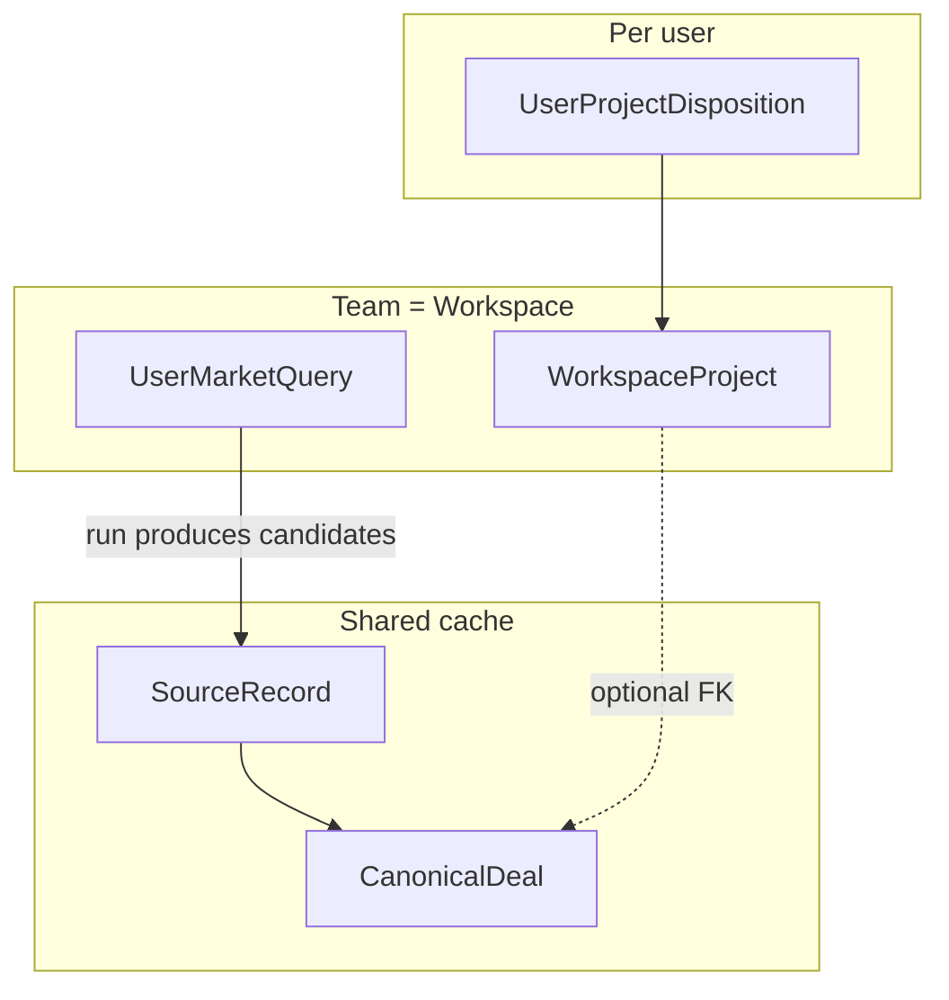

# Teams, projects, dealbox, and user-scoped market queries

Product language **Team** maps to the existing tenant **Workspace** ([ADR 0012](../decisions/0012-multi-tenancy-workspace-as-tenant.md)): better-auth **organizations** back `Workspace`; memberships and invites are first-class there. This doc names the **deal pipeline** shapes that sit on top.

## Stable user identity (not email)

All **per-user** ownership and attribution use better-auth’s stable **`user.id`** (internal primary key) — e.g. `UserMarketQuery.owner_user_id`, `UserProjectDisposition.user_id`, JWT `ClearboltClaims.userId`.

- **Do not** use email (or any login identifier) as the foreign key for searches, dealbox, or projects. Users can change email; `user.id` does not change for the same account.
- Invites still **address** the recipient by email; acceptance binds the invite to the resolved `user.id`.

## Entities

| Product term | Storage term | Notes |
|--------------|--------------|--------|
| Team | `Workspace` | Tenant boundary; R2 prefix `workspaces/<workspaceId>/`; all team tables carry `workspaceId`. |
| Team member | `Membership` | better-auth org membership + role (`owner` \| `admin` \| `member` \| `viewer`). |
| Invite | Org invite flow | better-auth; email via Resend / Cloudflare path configured in app env. |
| **Project** | `WorkspaceProject` | Team-owned **pipeline object** for a **potential** deal: title, optional link to shared `CanonicalDeal` once known, status (`candidate`, `researching`, …). Multiple members can see the same project. |
| **Dealbox** | `UserProjectDisposition` where `bucket = dealbox` | **Per user**, per team: projects the user is actively tracking. Same project can be in one user’s dealbox and absent from another’s. |
| **Anti-dealbox** | `UserProjectDisposition` where `bucket = anti_dealbox` | **Per user**: explicit “not interested” (`source = user`) or model-inferred (`source = ai`, optional `aiConfidence`). Starts on **projects**; extending to raw canonicals without a project is a follow-up if product requires it. |
| **User-scoped search** | `UserMarketQuery` | A BizBuySell (or other adapter) **search URL + adapter** owned by **`owner_user_id` = better-auth `User.id`** (internal), scoped to a team via `workspace_id`. Scraper / queue runs keyed by this row so ingestion and ranking can differ per user while listings still merge into the **shared** canonical cache. |

Shared listing truth stays **global** (`CanonicalDeal`, `SourceRecord` dedup per [0003](../decisions/0003-multi-source-preservation.md)). Team and user layers only add **pointers, disposition, and query intent**—never a second copy of raw evidence for the same listing.

## Relationships (conceptual)

## Project promotion: deep research and documents (V1+)

When a listing is **promoted to a `WorkspaceProject`** (or linked via `canonical_deal_id`), the product path is:

1. **Deep research** — agent/harness jobs (see [`harness.md`](harness.md), [`ai-usage.md`](ai-usage.md)) over listing evidence + structured fields; summaries and risks land in the **per-workspace wiki** ([`wiki.md`](wiki.md)) under predictable paths (e.g. `deals/<projectOrDealId>/…`).
2. **Advancing deal** — users upload or attach **dataroom, legal, and other documents** via the document pipeline ([`data-model.md`](data-model.md) document store; captures in [`capture.md`](capture.md)); same tenant rules apply (`workspaceId` + optional `userId` for private drafts).
3. **Fast insight** — re-run or incremental maintainer skills on new artifacts; embeddings and dedup stay on shared/canonical + workspace indexes per existing ADRs.

Shared canonical evidence is not duplicated; project rows **point** at canonicals and hang workspace-private analysis off them.

## Scraper / query behavior

- **Default:** A `UserMarketQuery` row defines **who** cares (`owner_user_id` = internal `user.id`), **which team** (`workspace_id`), **which adapter + search URL**, and optional schedule metadata in `metadata` json.
- **Workers** load active queries with `(workspace_id, owner_user_id)` (or team-wide saved searches later) and enqueue fetch jobs; dedup still merges into **shared** canonicals.
- **Personalization:** Dealbox / anti-dealbox drive ranking and suppression for **that user’s** UI and notifications; team-level `WorkspaceRankingProfile` ([data-model](data-model.md)) can still exist for shared team taste.

## Auth env (local)

Google OAuth and Resend keys live in repo-root `.env.cloud.local` / `.env.dev` (see [`.env.example`](../../.env.example)): `GOOGLE_CLIENT_ID`, `GOOGLE_CLIENT_SECRET`, `RESEND_API_KEY`, etc. Wiring into better-auth + Next.js is **V1 app work**; Neon tables here are **schema-forward** so migrations and product stay aligned.

## Validation criteria

- **Given** a `WorkspaceProject` in workspace A, **when** user U (member of A) writes `UserProjectDisposition` `dealbox` for that project, **then** user V (also member of A) does not automatically get the same disposition unless V writes their own row. Coverage: integration. Test: `packages/storage-neon/tests/user-project-disposition-isolation.test.ts`.
- **Given** two `UserMarketQuery` rows with the same `search_url` but different `owner_user_id` (both internal user ids), **when** runs are recorded, **then** each run’s downstream ranking / notifications respect the owning user’s dealbox rules independently. Coverage: integration. Test: `services/scraper-worker/tests/user-query-scoping.test.ts` (TBD V1).
- **Given** a user who changes their login email in better-auth, **when** their `user.id` is unchanged, **then** all `UserMarketQuery` and `UserProjectDisposition` rows for that user still resolve correctly. Coverage: integration. Test: `packages/auth/tests/email-change-preserves-user-scoped-rows.test.ts`.
- **Given** any row in `user_project_dispositions` or `user_market_queries`, **when** inspected, **then** `workspace_id` is non-null and matches a workspace the subject user (`user_id` / `owner_user_id`) is a member of (enforced in write API, not only DB). Coverage: integration. Test: `apps/web/tests/tenant-isolation/workspace-project-writes.test.ts` (TBD V1).

## Cross-links

- [data-model.md](data-model.md) — workspace search, finds, feedback (adjacent concepts).
- [packages/auth/agents.md](../../packages/auth/agents.md) — invites, OAuth, token `workspaceId`.
- [dedup.md](dedup.md) — shared canonical layer unchanged.
