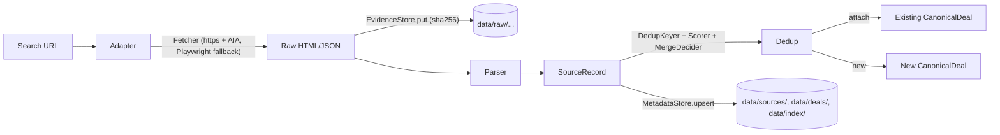

# V0 — Scraper-only walking skeleton (local dev)

> V0 is **local-dev only**. It does not deploy to production. It validates the contracts that V1+ cloud backends will satisfy. Production starts at V1 ([V1.md](V1.md)).

## Goal

Prove we can pull listings from at least one marketplace, normalize them, and recognize duplicates across sources — all behind storage interfaces that can swap from disk to Neon + R2 without rewriting the scraper, dedup, or any consumer.

## Scope

- One marketplace adapter end-to-end. Suggested: BizBuySell (best-documented prior art, Akamai presence forces us to exercise the AIA + browser-fallback wisdom up front).
- CLI / script entry: `pnpm clearbolt scrape <search-url>` and `pnpm clearbolt catalog <state-catalog-url>` (paginated discovery + optional ingest). Catalog refs can be written to `data/catalog-refs/<slug>.json` for resume ingest.
- Storage interfaces wired to disk-backed defaults baked into `packages/storage`:
  - `EvidenceStore` -> `data/raw/<adapter>/<sha256>.html|.json` (content-addressed).
  - `MetadataStore` -> JSON/JSONL files (`data/sources/<id>.json`, `data/deals/<canonical_id>.json`, `data/index/<keyType>.json`).
  - `WikiStore` is contract-only in V0; no wiki maintainer agent yet.
- Multi-source provenance is a hard requirement: every observation is preserved as its own `SourceRecord` and linked to the same canonical deal. `sources[]` and per-field provenance are populated.
- **Programmatic deduplication** in V0 — deterministic keys + lexical/numeric/geo scorers. Optional OpenRouter LLM blend and embeddings when `OPENROUTER_API_KEY` / `CLEARBOLT_DEDUP_EMBED=1` are set (CI requires the key for live tests). See [../architecture/dedup.md](../architecture/dedup.md).
- Replayable: re-running normalization against stored raw payloads must produce the same canonical state without hitting source sites.
- No production UI or auth in the V0 CLI path. Local **hybrid dev** may run [`apps/web`](../apps/web/agents.md) + Neon/R2 + [`apps/scraper-service`](../apps/scraper-service/agents.md) against cloud env files — that exercises V1 surfaces without changing V0 acceptance.

## Explicitly out of scope (deferred to V1+)

- Web app, auth, workspaces.
- Browser extension.
- Wiki maintainer agent.
- Vector search and embeddings.
- Hosted transcript backends.
- Notifications, outreach, financial profile, market definition, ranking, quality-of-deal scoring.
- Cloud deployment (no Neon, no R2, no CF, no Fly).
- Multi-tenant boundaries beyond a single hardcoded workspace identifier.

## Acceptance criteria

- `pnpm clearbolt scrape <bizbuysell-search-url>` writes normalized source records and canonical deals to disk.
- `pnpm clearbolt scrape <same-url>` re-run produces zero net new canonical deals (every source resolves to an existing canonical via the dedup index).
- A second adapter (or a deliberately mock-syndicated source) attached to the same listing produces a second `SourceRecord` linked to the same canonical deal, with `sources[]` length 2.
- A re-extraction job that reads only from `EvidenceStore` reproduces the same canonical deals without network calls.
- Conformance suite for `EvidenceStore` and `MetadataStore` runs against disk backends and passes (the same suite will run against R2 / Neon backends in V1).

## Walking-skeleton path

## Notes for V1 carryover

Every contract built in V0 must survive V1 unchanged. The only thing that changes between V0 and V1 is which backend is bound:

- `EvidenceStore`: disk -> R2 via `packages/storage-r2`.
- `MetadataStore`: disk JSON -> Neon + Prisma via `packages/storage-neon`.
- `WikiStore`: not exercised in V0 -> wiki-fs in V1 dev / wiki-r2 in V1 prod.
- `Queue`, `Scheduler`, `Notifier`, `Embedder`, `VectorStore`: introduced fresh in V1.

If any V0 design choice forces a contract change in V1, it is a V0 bug.

## Validation criteria

V0 acceptance is met when every line in [Acceptance criteria](#acceptance-criteria) above passes its corresponding test:

### Functional
- **Given** a fresh `data/` directory and a BizBuySell search URL with at least one result, **when** `pnpm clearbolt scrape <url>` runs, **then** at least one `SourceRecord` and one `CanonicalDeal` are written to disk under `data/sources/` and `data/deals/`. Coverage: smoke (end-to-end). Test: `apps/cli/tests/scrape-end-to-end.smoke.test.ts::scrape_writes_records`.
- **Given** a `data/` directory populated by a prior scrape, **when** the same `pnpm clearbolt scrape <same-url>` is run again, **then** the count of `CanonicalDeal` files is unchanged. (V0 disk `MetadataStore` does not yet persist a `MergeCandidate` queue; that seam is specified for V1+ — see `packages/dedup/agents.md`.) Coverage: smoke. Test: `apps/cli/tests/scrape-end-to-end.smoke.test.ts::rerun_yields_zero_new_canonicals`.
- **Given** a `CanonicalDeal` already attached to a BizBuySell `SourceRecord`, **when** a mock-syndicated `SourceRecord` for the same listing is ingested, **then** it links to the same `CanonicalDeal` and `sources[]` length becomes 2 with per-field provenance updated. Coverage: integration. Test: `packages/dedup/tests/multi-source-attachment.test.ts::second_source_attaches_to_canonical`.
- **Given** a populated `EvidenceStore`, **when** `pnpm clearbolt replay` runs with network access disabled, **then** the resulting `CanonicalDeal` set is byte-identical to the original scrape. Coverage: smoke. Test: `apps/cli/tests/replay.smoke.test.ts::replay_reproduces_canonicals_offline`.
- **Given** a fresh `data/domain/` tree, **when** `pnpm clearbolt domain mark <host> --browser` then `pnpm clearbolt domain mark <host> --http`, **then** `MetadataStore.getDomainProfile` returns `needsBrowser` true then false for that host. Coverage: smoke. Test: `apps/cli/tests/domain-command.smoke.test.ts::mark_browser_then_mark_http_updates_profile`.
- **Given** the `EvidenceStore` and `MetadataStore` conformance suites in `packages/storage`, **when** invoked with the disk backend factory, **then** every assertion passes. Coverage: conformance. Test: `packages/storage/tests/disk-evidence-store.test.ts::conformance` and `packages/storage/tests/disk-metadata-store.test.ts::conformance`.

### Non-functional
- **Given** a typical V0 dev machine (2020-era SSD, Node 22), **when** scraping ~50 listings end-to-end, **then** the run completes in under 10 minutes (BizBuySell-side latency dominates; we are not optimizing here, just bounding pathology). Coverage: smoke (manual). Test: documented in `apps/cli/tests/scrape-end-to-end.smoke.test.ts` (skipped by default).

### Spec discipline
- **Given** the V0 codebase, **when** `pnpm lint:specs` runs, **then** every `agents.md`, ADR, and `docs/architecture/`, `docs/phases/`, `docs/operations/`, `docs/product/` doc has a `## Validation criteria` (or `## Falsifiability criteria`) section. Coverage: smoke. Test: `scripts/lint-specs.mjs::all_spec_docs_have_criteria` (V0 advisory; V1+ CI gate).

### Failure modes
- **Given** a scrape against a host that escalates to WAF block on the HTTP lane, **when** the scrape runs, **then** the `WafDetector` classifies the response, policy caps HTTP retries, and the CLI persists `needsBrowser=true` on `DomainProfile` when the HTTP lane is exhausted on search or listing fetches; when Playwright is available (and `CLEARBOLT_SKIP_BROWSER` is unset), the same run may continue on the browser fetcher (full `CrawlEngine` persistence TBD). Coverage: integration. Test: `packages/scraper/tests/engine-escalation.test.ts` (includes `http_block_routes_to_browser_or_persists`); listing/search policy loop: `packages/scraper/tests/fetch-waf-policy.test.ts`.
- **Given** an HTTPS host serving an incomplete certificate chain, **when** `HttpFetcher` connects, **then** AIA fetches the missing intermediate, builds an https.Agent with the full chain, caches it for the host, and the request succeeds. Coverage: integration. Test: `packages/scraper/tests/aia.test.ts::aia_completes_chain_for_incomplete_host`.
