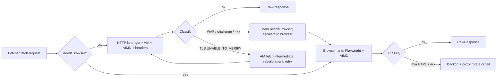

# `packages/scraper`

> Runtime: **node** (Fly.io). Cloudflare Workers port is possible later for the HTTP-only path but not pursued — Playwright + native binaries + AIA TLS work require Node, and the cost tradeoff vs Browser Rendering does not justify it at our volume.

The scraper is the production embodiment of hard-won lessons from a prior Akamai-heavy scraping project. The architecture is **HTTP-first, browser when needed**, with TLS / AIA fixed at the Node level, per-domain AIMD throttling, WAF heuristics that escalate intelligently rather than retry forever, and a `needsBrowser` persistence layer that remembers hard hosts across restarts.

This document encapsulates that wisdom so future contributors do not relearn it.

## Architecture: HTTP-first, browser when needed

The old single-lane Crawlee-only flow is replaced by a `CrawlEngine` that runs **two lanes**:

- **High-concurrency HTTP** (`got`) for cheap fetches when they succeed.
- **Playwright** only when HTTP is not enough, or when the page is wrong for HTTP (SPA, Akamai challenge, etc.).

This matters for Akamai because bare Node HTTP often gets 401/403 challenge pages, while a real browser session can complete the challenge or serve full HTML.

## TLS / certificate chain (AIA)

`packages/scraper/src/tls-aia.ts` (planned) is a per-domain HTTPS agent factory with AIA-fetched intermediate certificates.

When a server sends an incomplete certificate chain (missing intermediate), Node.js's TLS layer rejects it with `UNABLE_TO_VERIFY_LEAF_SIGNATURE`. Browsers handle this via AIA (Authority Information Access) — they read the CA Issuers URL from the leaf cert, download the intermediate, and build the full chain automatically.

This module replicates that behavior for `got` / `node:https`:

1. Connect with `rejectUnauthorized: false` to get the leaf cert.
2. Parse the AIA "CA Issuers" URL from the cert extensions.
3. Download the intermediate cert (typically DER over HTTP).
4. Build an `https.Agent` with root CAs + the intermediate.
5. Cache the agent per hostname for reuse.

Many large CDNs serve incomplete chains; browsers hide it, Node does not. AIA fixes Node-side robots, sitemap, SEO/favicon, and the HTTP HTML pipeline so those calls verify TLS like a browser. On TLS failure, HTTP handling retries after AIA or falls back to the browser if AIA cannot fix it.

## WAF / Akamai-style blocks

- **HTTP path**: 401/403 -> treat as WAF/auth -> escalate to Playwright (not endless retries on `got`).
- **Browser path**: same statuses trigger extra wait and a minimum HTML size check (`wafMinHtmlChars` / `wafExtraWaitMs`). If the body stays tiny, treat as blocked and error so retry/proxy-rotation logic can kick in.

The `WafDetector` contract classifies responses into `ok | challenge | block | rate_limited` and emits escalation hints. V0 ships heuristic rule packs covering Akamai, Cloudflare, PerimeterX. New WAF families add as plugin rule packs.

## Behavior under load: per-domain AIMD throttling

`DomainThrottleManager` adds adaptive per-domain limits:

- Slow start.
- Backoff on errors / 429 / `Retry-After` / `crawl-delay`.
- Separate pools for HTTP and browser (a domain can be aggressive on HTTP and gentle on browser, or vice versa).

This reduces the "burst of identical clients" pattern that often trips bot managers. State is persisted in `MetadataStore` so AIMD memory survives restarts.

## Remembering hard hosts: `needsBrowser`

Domains that once required a browser get `needsBrowser: true` in `MetadataStore.DomainProfile`. After restart, those hosts are routed toward the browser lane to avoid wasting cycles on HTTP-only attempts that we already know will fail.

`needsBrowser` is set:

- Automatically when WAF detection escalates HTTP -> browser successfully on a domain N times in a row.
- Manually by an operator (`pnpm clearbolt domain mark <host> --browser`).

`needsBrowser` is unset:

- Manually after a domain stops blocking (operator command).
- Periodically auto-tested by a low-priority HTTP probe — if N successes, downgrade.

## Other pieces

- **Browser-like request headers** on HTTP fetches (`Sec-Fetch-*`, `Accept`, `Accept-Language`, `User-Agent`, etc.) so we look less like a minimal scraper client.
- **SPA detection on HTTP**: very little text + framework markers (Next.js / React / Angular hydration scripts) -> escalate to browser.
- **CDN asset domains**: Akamai host suffixes, Cloudfront, etc. are treated as assets, not crawl targets, and routed away from the listing pipeline.

Together: fix Node TLS like a browser (AIA), try fast HTTP first with realistic headers, throttle per domain, persist "browser-only" domains, and use Playwright + WAF heuristics when the edge returns 401/403 or thin challenge HTML.

## Contracts

The scraper exposes these contracts (full inventory in [`docs/architecture/contracts.md`](../../docs/architecture/contracts.md)):

- `Fetcher` — `HttpFetcher`, `BrowserFetcher`, `MockFetcher`, optional `ApifyFetcher` ([adapters/bizbuysell/apify.md](adapters/bizbuysell/apify.md), [ADR 0013](../../docs/decisions/0013-apify-as-optional-fallback.md)).
- `ThrottleManager` — per-domain AIMD with persisted state.
- `WafDetector` — heuristic rule packs.
- `ProxyPool` — V0 direct only; V1+ residential / datacenter providers via env config.
- `Adapter` — per-source: `parseSearchUrl`, `discoverListingRefs`, `fetchListingDetail`, `extractBrokerLinks`.

## Adapters

One per site, in `packages/scraper/adapters/<source>/`:

- [bizbuysell](adapters/bizbuysell/agents.md) — primary, V0.
- [bizquest](adapters/bizquest/agents.md) — V1.
- [businessbroker](adapters/businessbroker/agents.md) — V1.
- [businessesforsale](adapters/businessesforsale/agents.md) — V1.
- [loopnet](adapters/loopnet/agents.md) — V1+.
- [bizben](adapters/bizben/agents.md) — V1+ (CA-heavy).
- [dealstream](adapters/dealstream/agents.md) — V1+.

Adapters do not branch on lane (HTTP vs browser). Both lanes feed the same `RawSourceRecord` shape; lane selection is `Fetcher`-level.

## Where it runs

**Fly.io.** Two reasons:

1. Playwright + ffmpeg + native binaries do not run on CF Workers.
2. AIA TLS handling, AIMD persistence, long-running browser sessions all want a long-lived Node process; Workers' per-request CPU model fights this.

A future CF Worker port is possible for the **HTTP-only** lane on cooperative sites, but Cost Browser Rendering at our volume is not better than Fly Playwright. Tracked in [`docs/decisions/open.md`](../../docs/decisions/open.md).

## V0 walking skeleton (this package's slice)

- `HttpFetcher` (got + AIA) + `MockFetcher` (tests).
- `ThrottleManager` (in-process AIMD, in-memory state — persistence to `MetadataStore` lands when MetadataStore lands).
- `WafDetector` with Akamai rule pack (since BizBuySell uses Akamai, this exercises the wisdom up front).
- `crawl-policy.ts` + `fetch-with-waf-policy.ts` — bounded HTTP retries after `classifyWaf`; when the HTTP lane is exhausted, persist `needsBrowser` then optionally continue on the Playwright-backed `browserFetcher` (wired in the CLI scrape path with `openBrowserSession`).
- `BrowserFetcher` — Chromium via Playwright (`openBrowserSession`): one process per CLI scrape, shared across search + listing fetches when HTTP is skipped or exhausted; disabled with `CLEARBOLT_SKIP_BROWSER=1` or `--fixtures`. After `pnpm install`, run **`pnpm ensure:playwright`** from the repo root once per machine/image to download Chromium (see root README).
- One adapter end-to-end: `adapters/bizbuysell/`.

## Validation criteria

### Contracts
- **Given** `hostRequiresBrowser` is true and no `browserFetcher`, **when** `fetchHtmlWithHttpWafPolicy` runs, **then** it throws before any HTTP `Fetcher.fetch` and does not call `persistNeedsBrowser`. Coverage: integration. Test: `packages/scraper/tests/fetch-waf-policy.test.ts::throws_when_host_requires_browser_but_no_browser_fetcher`.
- **Given** `hostRequiresBrowser` is true with a `browserFetcher`, **when** `fetchHtmlWithHttpWafPolicy` runs, **then** the HTTP fetcher is never used and the browser response is returned. Coverage: integration. Test: `packages/scraper/tests/fetch-waf-policy.test.ts::uses_browser_when_host_requires_browser_without_http_fetch`.
- **Given** a `Fetcher` that returns 429 twice then 200 for the same URL, **when** `fetchHtmlWithHttpWafPolicy` runs with default `maxHttpAttempts`, **then** the third response is returned and `persistNeedsBrowser` is never called. Coverage: integration. Test: `packages/scraper/tests/fetch-waf-policy.test.ts::retries_rate_limit_then_succeeds`.
- **Given** a `Fetcher` that returns only 429 for the same URL and no `browserFetcher`, **when** `fetchHtmlWithHttpWafPolicy` exhausts HTTP retries, **then** `persistNeedsBrowser` is invoked once for that host and the function throws. Coverage: integration. Test: `packages/scraper/tests/fetch-waf-policy.test.ts::throws_after_max_rate_limited_when_no_browser_fetcher`.
- **Given** HTTP WAF exhaustion with a `browserFetcher`, **when** `fetchHtmlWithHttpWafPolicy` runs, **then** `persistNeedsBrowser` is invoked once and the returned body comes from the browser fetcher. Coverage: integration. Test: `packages/scraper/tests/fetch-waf-policy.test.ts::persists_needs_browser_after_max_rate_limited_attempts_then_browser`.
- **Given** `CLEARBOLT_SKIP_BROWSER=1`, **when** `openBrowserSession` runs, **then** it returns null without importing Playwright. Coverage: integration. Test: `packages/scraper/tests/browser-fetcher.test.ts::returns_null_when_CLEARBOLT_SKIP_BROWSER`.
- **Given** HTTP returns 403 and a `browserFetcher`, **when** `fetchHtmlWithHttpWafPolicy` runs, **then** `persistNeedsBrowser` is invoked once and the returned body comes from the browser fetcher. Coverage: integration. Test: `packages/scraper/tests/fetch-waf-policy.test.ts::persists_on_challenge_then_browser_when_configured`.
- **Given** HTTP returns 403 and no `browserFetcher`, **when** `fetchHtmlWithHttpWafPolicy` runs, **then** `persistNeedsBrowser` is invoked once and the function throws. Coverage: integration. Test: `packages/scraper/tests/fetch-waf-policy.test.ts::persists_on_challenge_without_browser_still_throws`.
- **Given** any `Fetcher` backend, **when** the conformance suite runs, **then** all assertions pass (`Fetcher.fetch` returns a `RawResponse` with `status`, `body`, `finalUrl`, `headers`, `evidenceRef`). Coverage: integration. Test: `packages/scraper/src/conformance/fetcher.suite.ts` (TBD V0).
- **Given** a `WafDetector` classification and attempt count, **when** `planHttpLaneAfterWaf` runs, **then** challenge/block persist `needsBrowser` without endless HTTP retry, rate limits retry up to `maxHttpAttempts` then persist, and `ok` continues. Coverage: integration. Test: `packages/scraper/tests/engine-escalation.test.ts`.
- **Given** any `WafDetector`, **when** fed the fixture corpus in `packages/scraper/tests/fixtures/waf/*`, **then** classification matches the labeled expectation (`ok | challenge | block | rate_limited`). Coverage: golden-set. Test: `packages/scraper/tests/waf-detector.test.ts` (TBD V0).
- **Given** any `Adapter`, **when** the conformance suite runs, **then** `parseSearchUrl` round-trips, `discoverListingRefs` yields at least one ref on a fixture page, and `fetchListingDetail` produces a `RawSourceRecord` with provenance. Coverage: golden-set. Test: `packages/scraper/src/conformance/adapter.suite.ts` (TBD V0).

### Functional
- **Given** an HTTP response with `UNABLE_TO_VERIFY_LEAF_SIGNATURE`, **when** AIA fetch succeeds, **then** the agent is rebuilt and the retry succeeds without falling back to browser. Coverage: integration. Test: `packages/scraper/tests/aia-recovery.test.ts` (TBD V0).
- **Given** a domain that returns 401/403 to HTTP twice in a row, **when** the third attempt completes, **then** the domain's `DomainProfile.needsBrowser` is `true` and subsequent fetches route to the browser lane. Coverage: integration. Test: `packages/scraper/tests/needs-browser-promotion.test.ts` (TBD V0).
- **Given** a 429 with `Retry-After`, **when** received, **then** `DomainThrottleManager` waits at least the indicated interval before the next request to that domain. Coverage: integration. Test: `packages/scraper/tests/aimd-respects-retry-after.test.ts` (TBD V0).
- **Given** an HTTP response classified as SPA-skeleton (low text + framework markers), **when** received, **then** the request is escalated to the browser lane. Coverage: integration. Test: `packages/scraper/tests/spa-detection.test.ts` (TBD V0).
- **Given** any successful fetch, **when** complete, **then** the raw body is written to `EvidenceStore` and `RawSourceRecord.evidenceRef` references it. Coverage: integration. Test: `packages/scraper/tests/evidence-stored.test.ts` (TBD V0).

### Drift / freshness
- **Given** any adapter with canary fixtures, **when** the daily canary fails twice consecutively, **then** the adapter is marked degraded and an alert fires. Coverage: smoke. Test: `services/adapter-canary/tests/two-strikes-degrade.test.ts` (TBD V1).

### Operational
- **Given** the scraper restarts, **when** it resumes, **then** AIMD state and `needsBrowser` are restored from `MetadataStore.DomainProfile`. Coverage: integration. Test: `packages/scraper/tests/state-survives-restart.test.ts` (TBD V0).
